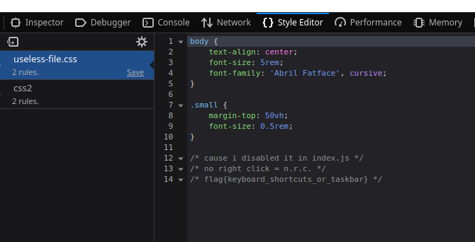

### NRC

# HINT:- No Right Click

- In this challenge the right click does not work but there is a way around this either press f12 or CTRL + SHIFT + C to bring up the dev tools.
- Then navigate to style editor tab and your flag is in useless-file.css

# OR

- You can press CTRL + U to bring up the source code and click on the useless-file.css to get the flag

