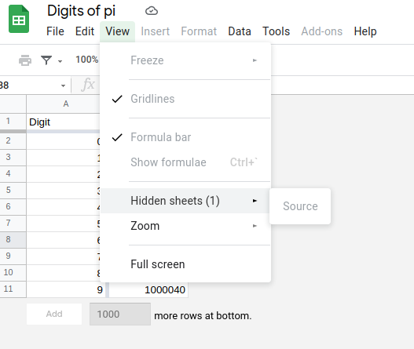
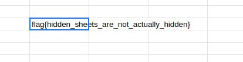

### DIGITS-OF-PI

- In this challenge you are presented with a google sheets with some numbers in the first 2 column.
- There is a hidden sheet named source from which the data has been pulled.

- This challenge can be solved by just searching the term flag and make sure to select all sheets while doing so.

- Here is the flag

