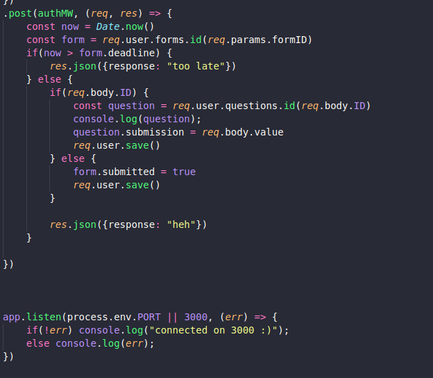
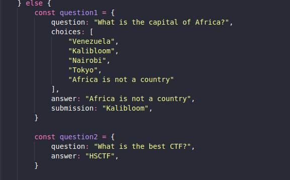
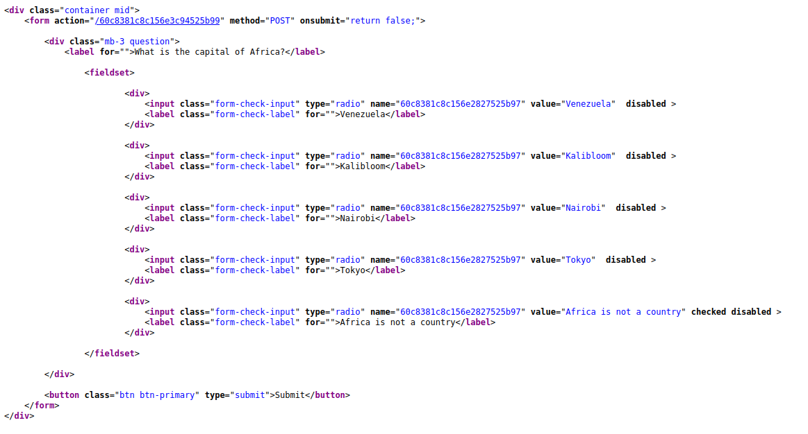
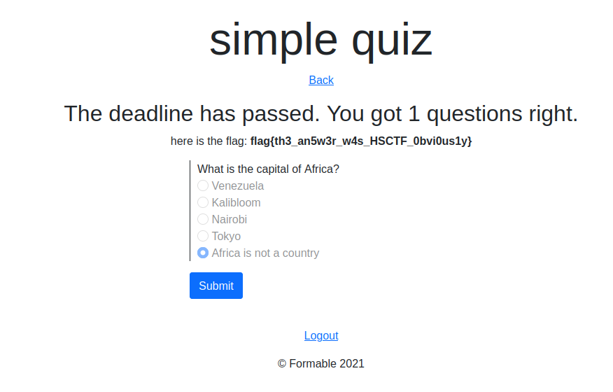

### GRADING

After you register there are 2 questions and you can answer only one as the other questions deadline has passed the. The server code is also given and if you take a look in it.

- Here you can see that the post request at /:formId is reading forms id from url and questions id and value from the post data.
- We can make a request too form 2 whose deadline has not passed and pass the id and value of the first question.
- For this we need form id and you can find it in the home page (after login) source code

- Now we need to find the question id of the first question and the right answer.
- We can find the right answer in the source code and the question id from the source code of first form

- The name parameter here is the id of first question and the right answer is `Africa is not a country`

# Note:- The form ids and question ids will be different for every user

- Now we make a post request to 2nd form with post data as `ID=[first-qid]&value=Africa+is+not+a+country`
- After doing this if you visit the first question again you are presented with the flag

- I wrote a  which automates this process and prints the flag

# Note:- This challenge won't work anymore as there is a deadline for question 2 as well smh
