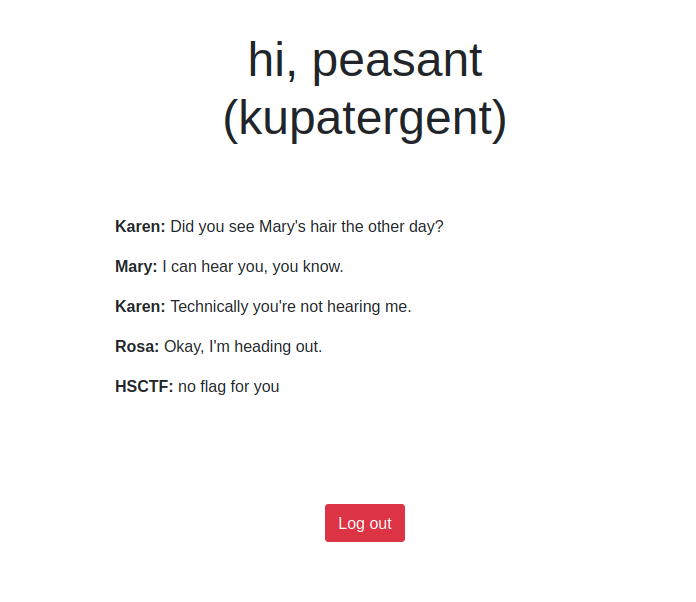
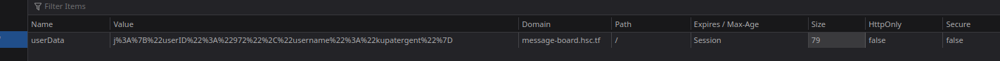
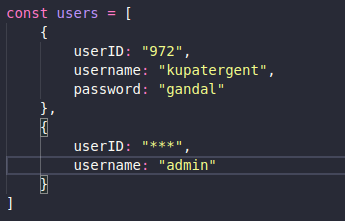

### MESSAGE BOARD

- In this challenge you are given a username: `kupatergent` and password: `gandal`
- Server code was attached and sligtly modified.
- When you login with the given credentials you are presented with a screen.

- The information about the user is stored in the cookie named userData.

- After Decode we get `j:{"userID":"972","username":"kupatergent"}`. In the server code we can see that the user has 972 userId and on the admin its `***` this indicates that the userId of admin is also of 3 digit number.

- Now we know that the userId of admin is a 3 digit, we just need to bruteforce it.

Here is the  I used to solve this.

Later I came up with a faster 
